XDriven - Server-Driven UI FlutterApp
=====================================

XDriven is a powerful Flutter application built around a Server-Driven UI (SDUI) architecture. Unlike traditional applications where UI components are hardcoded, XDriven dynamically renders its entire interface from JSON data fetched from your backend.

Features
--------

Dynamic UI from JSON - Render entire screens and UI components from server-provided JSON

Zero-update UI Changes - Update layouts, content, and designs without pushing app updates

Custom Widget System - Extensive library of customizable widgets controlled through JSON properties

Backend-driven Navigation - Control app flow and navigation directly from your server

Animation Support - Add fade-ins, transitions, and other animations through JSON configuration

Full Routing System - Define and control routes without hardcoding screens

```mermaid
graph TD
    A[Start App] --> B[Initialize Provider and Splash]
    B --> C[Call Backend API via PageProvider with PageId]
    C --> D[Decode JSON: widgets, props, actions]
    D --> E[Pass to Renderer → UikWidget Mapping]
    E --> F[Render Dynamic Widgets on Screen]
    F --> G[Attach Tap Actions like Navigation]
```



How It Works🚀
-----------

XDriven follows a server-driven architecture where:

1. The app requests UI data from your backend API  (https://github.com/ShashwatXD/XDriven-Go)

2. The server responds with JSON describing screens, widgets, and actions

3. XDriven's renderer system translates this JSON into native Flutter widgets

4. User interactions trigger actions defined in the JSON (navigation, API calls, etc.)


What Makes XDriven Unique
------------------------

Dynamic UI via JSON — All widgets on the screen (text blocks, containers, icons, buttons) are described in JSON and rendered dynamically.

Renderer System — The Renderer class maps each uiType to its corresponding Flutter widget (UikText, UikContainer, etc.).

Custom Widgets with Props — Widgets are styled through custom props like padding, fontSize, color, alignment.

Navigation from Backend — Page navigation and URL launches are handled through JSON-defined action props.

Animation Support — Animations are managed using AnimatedContainer and AnimatedOpacity.

Full Routing Support — Routes like /home, /about are resolved from JSON without hardcoding screens.


## How to Run the App

### 1. Clone the Repository

Clone the repository with:

```bash
git clone https://github.com/ShashwatXD/XDriven-App

```
###2. Install Dependencies
```bash
 flutter pub get
```
### 3.Run the App
```bash
flutter run
```

